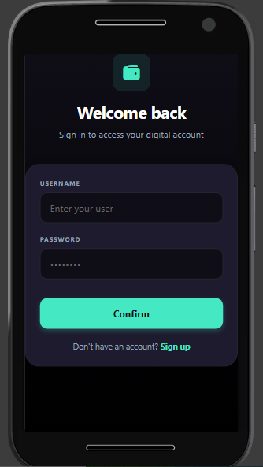
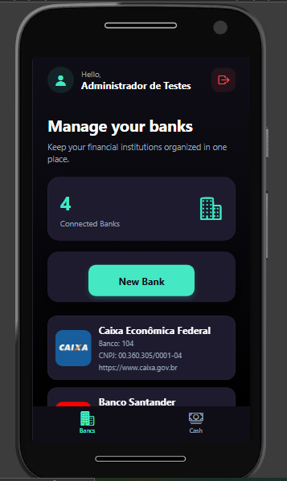
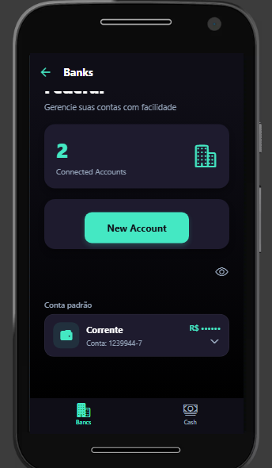
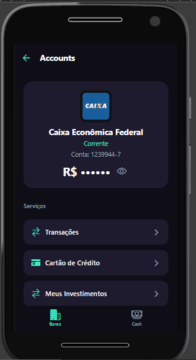

# 💰 Aplicativo Financeiro

> Aplicação Mobile de gerenciamento financeiro desenvolvida com React Native,
> utilizando componentes reutilizáveis, Context API, persistência local e
> integração com APIs REST.

<p align="center">
  
  
  
  
</p>

---

## 📱 Sobre o projeto

O **Aplicativo Financeiro** é um projeto **Mobile Front-End desenvolvido em
React Native**, com foco no gerenciamento de bancos, contas bancárias,
transações, cartões de crédito e investimentos.

A aplicação possui uma arquitetura baseada em **componentes reutilizáveis**,
gerenciamento de estado global através da **React Context API** e comunicação
com servidores através de **APIs REST**.

O projeto foi desenvolvido de forma desacoplada do Back-End, permitindo que
o aplicativo possa consumir uma API desenvolvida utilizando diferentes
tecnologias.

Entre as possibilidades de Back-End estão:

- 🐘 PHP;
- 🌐 Laravel;
- ☕ Spring Boot;
- 🟢 Node.js;
- ou qualquer outra tecnologia capaz de disponibilizar uma API REST.

---

# 📸 Preview

### 🔐 Login

<p align="center">
  
</p>

Tela de autenticação do aplicativo.

---

### 🏦 Banco

<p align="center">
  
</p>

Tela principal do banco, apresentando as contas cadastradas, conta
selecionada e saldo.

---

### 💳 Conta

<p align="center">
  
</p>

Tela de detalhes da conta, apresentando informações do banco, tipo da conta,
número, saldo e serviços disponíveis.

---

### 📈 Aplicações

<p align="center">
  
</p>

Tela de aplicações financeiras vinculadas à conta selecionada.

---

### 👁️ Valores visíveis

<p align="center">
  
</p>

Os valores financeiros podem ser visualizados normalmente.

---

### 🔒 Valores ocultos

<p align="center">
  
</p>

O usuário pode ocultar os valores financeiros através do controle de
visibilidade.

---

## 🖼️ Galeria

<p align="center">
  
  
  
  
</p>

<p align="center">
  
  
  
  
</p>

---

# 💡 Destaques técnicos

O projeto foi desenvolvido considerando alguns princípios importantes de
desenvolvimento de aplicações mobile:

- 📱 Arquitetura Mobile Front-End desacoplada do Back-End;
- 🔌 Integração com APIs REST;
- 🧠 Context API para gerenciamento de estado global;
- 🧩 Componentização da interface;
- ♻️ Componentes reutilizáveis;
- 💾 Persistência local com AsyncStorage;
- 👁️ Controle global de visibilidade dos valores financeiros;
- 🧭 Navegação entre diferentes módulos da aplicação;
- 🔄 Seleção global de banco e conta;
- 📊 Estrutura preparada para diferentes implementações de Back-End;
- 🚀 Estrutura preparada para evolução do projeto.

---

# ✨ Funcionalidades

O aplicativo permite ao usuário:

- 🔐 Realizar login;
- 🏦 Visualizar bancos cadastrados;
- 💳 Visualizar contas bancárias;
- ➕ Cadastrar novas contas;
- 🔄 Selecionar uma conta;
- 💰 Consultar saldos;
- 👁️ Mostrar ou ocultar valores financeiros;
- 📊 Consultar investimentos;
- 💵 Visualizar aplicações financeiras;
- 💳 Acessar cartões de crédito;
- 🔄 Consultar transações;
- 📋 Visualizar detalhes das contas;
- 📈 Acessar serviços relacionados a investimentos.

---

# 🛠️ Tecnologias utilizadas

## ⚛️ React Native

Framework utilizado para o desenvolvimento da aplicação mobile.

---

## 🚀 Expo

Utilizado para facilitar o desenvolvimento, execução e testes da aplicação
React Native.

---

## 🟨 JavaScript

Linguagem principal utilizada no desenvolvimento da aplicação.

---

## 🧠 React Context API

Utilizada para gerenciamento de informações globais da aplicação.

Entre os estados globais estão:

- usuário autenticado;
- banco selecionado;
- conta selecionada;
- visibilidade dos valores financeiros.

---

## 💾 AsyncStorage

Utilizado para armazenamento local das informações relacionadas à
autenticação do usuário.

---

## 🎨 Expo Linear Gradient

Utilizado para criação dos fundos com gradiente da aplicação.

---

## 🔷 Ionicons

Utilizado para os ícones da interface através do pacote:

```text
@expo/vector-icons
```

---

# 🏗️ Arquitetura

O aplicativo foi desenvolvido como um **Mobile Front-End**, utilizando uma
API REST como camada de comunicação com o Back-End.

```text
                 ┌─────────────────────────┐
                 │                         │
                 │      React Native       │
                 │    Mobile Front-End     │
                 │                         │
                 └────────────┬────────────┘
                              │
                              │ HTTP / REST
                              │ JSON
                              ▼
                 ┌─────────────────────────┐
                 │                         │
                 │       REST API          │
                 │                         │
                 └────────────┬────────────┘
                              │
              ┌───────────────┼───────────────┐
              │               │               │
              ▼               ▼               ▼
           PHP API       Laravel API    Spring Boot API
              │               │               │
              ▼               ▼               ▼
          JSON / DB        Database        Database
```

O Front-End não depende diretamente da tecnologia utilizada no servidor.

O principal requisito é que a API disponibilize os endpoints esperados pelo
aplicativo e mantenha o formato dos dados em JSON.

---

# 🔌 Opções de Back-End

O aplicativo pode consumir diferentes implementações de API REST.

As principais possibilidades consideradas neste projeto são:

- 🐘 PHP;
- 🌐 Laravel;
- ☕ Spring Boot.

Durante o desenvolvimento e prototipação também é possível utilizar uma API
PHP utilizando arquivos `.json`, sem a necessidade de um banco de dados.

---

# 🐘 API PHP com arquivos JSON

Uma alternativa simples para desenvolvimento, testes e prototipação é
utilizar uma API REST desenvolvida em PHP, armazenando os dados em arquivos
`.json`.

A arquitetura pode ser representada da seguinte forma:

```text
                 React Native
                      │
                      │ HTTP / REST
                      │ JSON
                      ▼
              ┌─────────────────┐
              │     PHP API     │
              │                 │
              │ REST Endpoints  │
              └────────┬────────┘
                       │
                       ▼
                Arquivos JSON
                       │
              ┌────────┼────────┐
              │        │        │
              ▼        ▼        ▼
            banks   accounts  applications
            .json     .json      .json
```

Essa abordagem é adequada principalmente para:

- desenvolvimento;
- testes;
- prototipação;
- demonstração;
- ambientes sem necessidade de banco de dados.

### Exemplo de estrutura

```text
php-api/
│
├── api/
│   ├── banks.php
│   ├── accounts.php
│   ├── applications.php
│   └── transactions.php
│
├── data/
│   ├── banks.json
│   ├── accounts.json
│   ├── applications.json
│   └── transactions.json
│
└── index.php
```

### Exemplo de `banks.json`

```json
[
    {
        "id_bnk": 1,
        "name_bnk": "Banco Principal",
        "img_bnk": "bank.png",
        "broker_bnk": false
    },
    {
        "id_bnk": 2,
        "name_bnk": "Banco Investimentos",
        "img_bnk": "investment.png",
        "broker_bnk": true
    }
]
```

---

# 🐘 PHP + Banco de Dados

Outra possibilidade é utilizar uma API REST desenvolvida em PHP conectada
a um banco de dados.

```text
                 React Native
                      │
                      │ HTTP / REST
                      │ JSON
                      ▼
              ┌─────────────────┐
              │     PHP API     │
              │                 │
              │ REST Endpoints  │
              └────────┬────────┘
                       │
                       ▼
                    Database
                       │
                ┌──────┴──────┐
                ▼             ▼
              MySQL        MariaDB
```

Essa abordagem é mais adequada para aplicações que necessitam de
persistência de dados, relacionamentos entre entidades e operações
simultâneas.

---

# 🌐 API Laravel

O aplicativo também pode consumir uma API REST desenvolvida utilizando
Laravel.

```text
                 React Native
                      │
                      │ HTTP / REST
                      │ JSON
                      ▼
              ┌─────────────────┐
              │   Laravel API   │
              │                 │
              │ REST Endpoints  │
              └────────┬────────┘
                       │
                       ▼
                    Database
                       │
                ┌──────┴──────┐
                ▼             ▼
              MySQL       PostgreSQL
```

O Laravel pode ser utilizado para implementar:

- autenticação;
- usuários;
- bancos;
- contas;
- transações;
- cartões;
- investimentos;
- aplicações financeiras;
- validação dos dados;
- regras de negócio.

---

# ☕ API Spring Boot

Outra possibilidade é utilizar Spring Boot para implementar o Back-End da
aplicação.

```text
                 React Native
                      │
                      │ HTTP / REST
                      │ JSON
                      ▼
              ┌─────────────────┐
              │ Spring Boot API │
              │                 │
              │ REST Endpoints  │
              └────────┬────────┘
                       │
                       ▼
                    Database
                       │
                ┌──────┴──────┐
                ▼             ▼
           PostgreSQL       MySQL
```

O Spring Boot pode ser utilizado para implementar a camada de serviços,
regras de negócio, autenticação e acesso ao banco de dados.

---

# 🔄 Arquitetura geral

Independentemente da tecnologia utilizada no Back-End, o aplicativo
React Native mantém sua função de **Mobile Front-End**.

```text
                         React Native
                       Mobile Front-End
                              │
                              │
                       HTTP / REST / JSON
                              │
               ┌──────────────┼──────────────┐
               │              │              │
               ▼              ▼              ▼
           PHP API        Laravel API    Spring Boot API
               │              │              │
               ▼              ▼              ▼
          JSON / DB        Database       Database
```

Dessa forma, a implementação do servidor pode ser alterada sem modificar
necessariamente a estrutura principal do aplicativo.

O principal requisito é manter o contrato da API, incluindo:

- endpoints;
- métodos HTTP;
- parâmetros;
- códigos de resposta;
- estrutura dos objetos JSON.

---

# 📂 Estrutura do projeto

Uma estrutura aproximada do projeto:

```text
src/
│
├── components/
│   ├── AccountCard/
│   ├── AccountDropdown/
│   ├── AccountList/
│   ├── AccountModal/
│   ├── ApplicationCard/
│   ├── ApplicationList/
│   ├── BankSummary/
│   ├── MenuCard/
│   ├── ValuesToggle/
│   └── ...
│
├── context/
│   └── app.js
│
├── pages/
│   ├── Bank/
│   ├── Account/
│   ├── Applications/
│   ├── Transactions/
│   ├── CreditCard/
│   └── ...
│
├── routes/
│   ├── app.routes.jsx
│   ├── auth.routes.jsx
│   ├── home.routes.jsx
│   └── index.jsx
│
├── services/
│   ├── api.jsx
│   ├── accounts.jsx
│   ├── applications.jsx
│   ├── banks.jsx
│   ├── request.jsx
│   └── ...
│
├── utils/
│   └── img/
│
└── App.js

docs/
│
└── images/
    ├── login.png
    ├── bank.png
    ├── account.png
    ├── applications.png
    ├── values-visible.png
    ├── values-hidden.png
    ├── transactions.png
    └── credit-card.png
```

---

# 🔌 Configuração da API

A aplicação possui uma camada de configuração para definir a URL da API.

Exemplo:

```javascript
const API = {

    baseURL: "http://127.0.0.1:3322",

    headers: {
        Accept: "application/json",
        "Content-Type": "application/json"
    }

};

export default API;
```

Também é possível utilizar uma API hospedada remotamente:

```javascript
const API = {

    baseURL: "https://php-financial-system.vercel.app",

    headers: {
        Accept: "application/json",
        "Content-Type": "application/json"
    }

};

export default API;
```

A URL utilizada pode ser alterada de acordo com o ambiente de
desenvolvimento ou produção.

---

# 🚀 Executando o projeto

## 1. Clonar o repositório

```bash
git clone URL_DO_REPOSITORIO
```

## 2. Entrar no projeto

```bash
cd nome-do-projeto
```

## 3. Instalar as dependências

```bash
npm install
```

ou:

```bash
yarn
```

## 4. Iniciar o Expo

```bash
npx expo start
```

Após iniciar o Expo, o aplicativo pode ser executado através de:

- Android;
- iOS;
- Expo Go;
- emulador Android;
- simulador iOS.

---

# 🌐 Configuração do Back-End

O aplicativo pode ser executado utilizando diferentes fontes de dados.

### Desenvolvimento

```text
React Native
      │
      ▼
PHP API
      │
      ▼
JSON
```

### Ambiente com banco de dados

```text
React Native
      │
      ▼
REST API
      │
      ▼
MySQL / PostgreSQL
```

### Ambiente com Laravel

```text
React Native
      │
      ▼
Laravel API
      │
      ▼
Database
```

### Ambiente com Spring Boot

```text
React Native
      │
      ▼
Spring Boot API
      │
      ▼
Database
```

---

# 🔐 Segurança e privacidade

O aplicativo possui um recurso de ocultação de valores financeiros.

Quando a opção de ocultar valores é ativada, os saldos são substituídos
visualmente por caracteres de ocultação.

Exemplo:

```text
R$ 10.500,50
```

passa a ser apresentado como:

```text
R$ ••••••
```

O estado de visibilidade pode ser compartilhado entre diferentes telas
através do gerenciamento global da aplicação.

> **Observação:** o recurso de ocultação é uma funcionalidade visual de
> privacidade e não substitui mecanismos de segurança, criptografia ou
> proteção de dados no Back-End.

---

# 📌 Considerações sobre o projeto

Este projeto possui como objetivo principal demonstrar conhecimentos em:

- desenvolvimento Mobile com React Native;
- criação de interfaces componentizadas;
- gerenciamento de estado;
- navegação entre telas;
- consumo de APIs REST;
- comunicação HTTP;
- manipulação de dados JSON;
- persistência local;
- organização de projetos;
- criação de componentes reutilizáveis;
- integração entre Front-End e Back-End.

O projeto pode evoluir futuramente para uma arquitetura completa envolvendo
autenticação, banco de dados, controle de usuários, segurança, testes
automatizados e diferentes serviços financeiros.

---

# 🚧 Próximas evoluções

Algumas funcionalidades que podem ser adicionadas futuramente:

- [ ] Autenticação com JWT;
- [ ] Cadastro de usuários;
- [ ] Recuperação de senha;
- [ ] Dashboard financeiro;
- [ ] Gráficos de receitas e despesas;
- [ ] Categorias financeiras;
- [ ] Filtros de transações;
- [ ] Paginação;
- [ ] Pull-to-refresh;
- [ ] Notificações;
- [ ] Biometria;
- [ ] Testes unitários;
- [ ] Testes de integração;
- [ ] Criptografia de informações sensíveis;
- [ ] Integração com banco de dados;
- [ ] API completa para produção.

---

# 👨‍💻 Objetivo do projeto

Este projeto foi desenvolvido como **projeto de portfólio**, com o objetivo
de demonstrar conhecimentos práticos em desenvolvimento de aplicações
mobile utilizando React Native.

O foco está principalmente na construção de um **Front-End Mobile
componentizado, reutilizável e desacoplado do Back-End**, permitindo sua
integração com diferentes tecnologias de servidor através de APIs REST.

---

# 📄 Licença

Este projeto está disponível para fins de estudo, demonstração e portfólio.